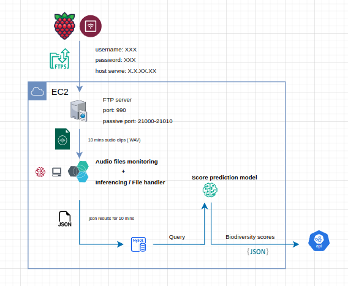

# Production Workflow on AWS-EC2 for Biodiversity Application

This is the repository for the production workflow on AWS-EC2 for the Biodiversity application.

## System Workflow



## Components Overview

### 1. Raspberry Pi and AudioMoth Devices
- **Audio Collection:** IoT devices Raspberry Pi and AudioMoth record audio in the wild.
- **Data Transmission:** Audio files are sent to an AWS EC2 instance for further processing.

### 2. AWS EC2 Setup
- **Environment:** The EC2 instance hosts the main audio processing pipeline.
- **Docker Setup:** Services run inside Docker containers.
    - **MySQL Database** (Container): Stores the classification results, device details, and related metadata.
    - **Audio Processor** (Container): Monitors new audio files, runs inference and stores results in MySQL.

### 3. MySQL Database
- **Database Structure:**
    - `RpiDevices` table stores information about the IoT devices (Pi ID, analysis date).
    - `SpeciesDetection` table stores species classification results for each audio segment, including the species detected, confidence score, and time segment information.
  
- **Persistence:** Data is preserved across container restarts by mounting a volume for MySQL database storage.

### 4. Audio Processing Pipeline
- **Monitoring:** A `watchdog` service continuously monitors the audio directory for new files.
- **Inference:** Uses (AttModel) to classify species in audio segments.
- **JSON Export:** Inference results (Pi ID, date, species detected, and confidence scores) are saved to MYSQL db.

  
### 5. Important Files
- `docker-compose.yml`: Docker services.
- `sqlmodel.py`: Script to create tables in the MySQL database.
- `audio_processor/audio_process.py`: Main script for monitoring and processing audio files.

## How to Run

```bash
git clone https://github.com/KaungHtetCho-22/production-workflow-ec2.git
cd production-workflow-ec2
docker compose up -d
docker exec -it audio_prcessor /bin/bash
cd audio_processor
python3 audio_processor.py

docker exec -it biosound_db /bin/bash
mysql -h localhost -P 3306 -u biosound_user -p biosound_password
